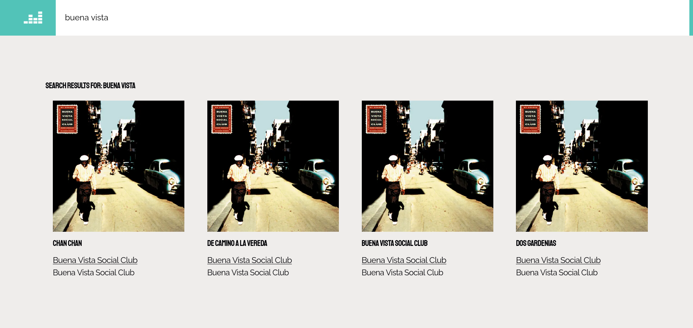

<div id="top"></div>


[![MIT License][license-shield]][license-url]
[![LinkedIn][linkedin-shield]][linkedin-url]

<br />
<div align="center">
  <h3 align="center">Kudzai Mabika • DVT Deezer Assessment</h3>

  <p align="center">
    <a href="https://github.com/othneildrew/Best-README-Template"><strong>View Demo »</strong></a>
    <br />
  </p>
</div>


<!-- ABOUT THE PROJECT -->
## About The Project


<br/>
<br>
A Music App built with Next.JS. Consuming the deezer api.
This project uses the Container Component Pattern separating the presentational part from the complex business logic. 

<p align="right">(<a href="#top">back to top</a>)</p>


### Built With


* [Next.js](https://nextjs.org/)
* [React.js](https://reactjs.org/)
* [Styled Components](https://vuejs.org/)

<p align="right">(<a href="#top">back to top</a>)</p>


<!-- GETTING STARTED -->
## Getting Started

To get a local copy up and running follow these simple example steps.

### Prerequisites

This project requires [PNPM](https://pnpm.io/).

* pnpm
  ```sh
  npm install -g pnpm
  ```

### Installation

1. Clone the repo
   ```sh
   git clone https://github.com/kmabika/dvt-assessment-kudzai-mabika.git
   ```
2. Install PNPM packages
   ```sh
   pnpm install
   ```
3. View project on your local development server
   ```js
   pnpm dev
   ```

<p align="right">(<a href="#top">back to top</a>)</p>


<!-- USAGE EXAMPLES -->
## Usage

<details>
  <summary>Screen Shots</summary>
  
  
  
</details>

<p align="right">(<a href="#top">back to top</a>)</p>

<!-- https://www.markdownguide.org/basic-syntax/#reference-style-links -->

[license-shield]: https://img.shields.io/github/license/othneildrew/Best-README-Template.svg?style=for-the-badge
[license-url]: https://github.com/othneildrew/Best-README-Template/blob/master/LICENSE.txt
[linkedin-shield]: https://img.shields.io/badge/-LinkedIn-black.svg?style=for-the-badge&logo=linkedin&colorB=555
[linkedin-url]: https://www.linkedin.com/in/kudzaimabika/